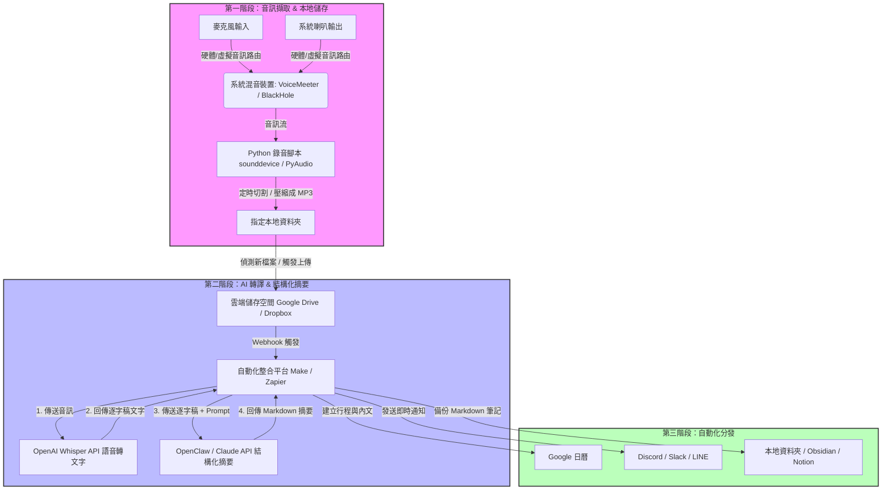

# AI AudioFlow 系統架構

## 概覽

本系統將麥克風與喇叭音訊自動錄製、轉譯、摘要，並分發至日曆、通訊平台與筆記工具。

---

## 流程圖

---

## 第一階段：音訊擷取 & 本地儲存

**目標**：同時捕捉麥克風輸入與系統喇叭輸出，合併後儲存至本地。

| 元件 | 工具 / 說明 |
|------|------------|
| 音訊來源 | 麥克風輸入、系統喇叭輸出 |
| 虛擬混音 | VoiceMeeter（Windows）/ BlackHole（macOS） |
| 錄音腳本 | Python — `sounddevice` 或 `PyAudio` |
| 輸出格式 | 定時切割 + 壓縮為 MP3，存至本地資料夾 |

---

## 第二階段：AI 轉譯 & 結構化摘要

**目標**：將錄製完成的音訊自動上傳、轉成文字，並生成結構化摘要。

### 處理步驟

1. **偵測新檔案** — 本地資料夾有新 MP3 時，自動上傳至雲端（Google Drive / Dropbox）
2. **Webhook 觸發** — 雲端上傳完成後觸發自動化平台（Make / Zapier）
3. **語音轉文字** — 將音訊傳送至 OpenAI Whisper API，取得逐字稿
4. **結構化摘要** — 將逐字稿 + Prompt 傳送至 Claude API，生成 Markdown 格式摘要

### 使用工具

- **雲端儲存**：Google Drive / Dropbox
- **自動化平台**：Make / Zapier
- **語音轉文字**：OpenAI Whisper API
- **摘要生成**：Claude API

---

## 第三階段：自動化分發

**目標**：將摘要結果自動推送至各目標平台。

| 輸出目標 | 用途 |
|---------|------|
| Google 日曆 | 建立會議行程與摘要內文 |
| Discord / Slack / LINE | 發送即時通知 |
| 本地資料夾 / Obsidian / Notion | 備份 Markdown 筆記 |
