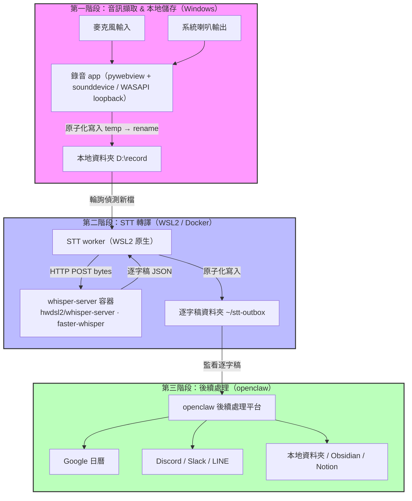

# AI AudioFlow 系統架構

## 概覽

本系統將麥克風與系統喇叭音訊自動錄製、轉譯為逐字稿，再交由 **openclaw** 進行後續的摘要與分發。

> 架構採**本地檔案系統交接**（同一台機器：Windows + WSL2 + Docker Desktop），不經雲端、不依賴 Make / Zapier。
> 核心原則：**STT（語音轉文字）與 openclaw 解耦** —— 「錄音檔 → 逐字稿」由一支獨立 worker 走 HTTP 完成；openclaw 的輸入是**逐字稿**，只負責逐字稿之後的後續處理。

---

## 流程圖

---

## 第一階段：音訊擷取 & 本地儲存（本專案）

**目標**：同時捕捉麥克風輸入與系統喇叭輸出，合併後**原子化**儲存至本地資料夾。

| 元件 | 工具 / 說明 |
|------|------------|
| 執行環境 | Windows，pywebview 桌面 app |
| 音訊來源 | 麥克風 + 系統喇叭輸出 |
| 系統音擷取 | Windows WASAPI loopback（`pyaudiowpatch`）；麥克風用 `sounddevice` |
| 混音 | 系統音 × 0.6 + 麥克風 × 0.6，clip 至 [-1, 1] |
| 輸出 | 寫到 `D:\record`，採 **temp → rename 原子化落地**（避免被讀到半寫入檔） |
| 格式 | WAV（可選壓縮為 MP3，STT 兩者皆可吃） |

> 職責邊界：本 app **只負責產出完整的音檔**，不做 STT / 摘要 / 分發。

---

## 第二階段：STT 轉譯（獨立 worker + whisper 容器）

**目標**：把錄音檔轉成逐字稿，與 openclaw 解耦。

### 處理步驟

1. **偵測新檔** — STT worker（跑在 WSL2 原生）**輪詢** `/mnt/d/record`（跨界 inotify 不可靠，故用輪詢）。
2. **送出轉譯** — 以 HTTP `POST` 把音檔 bytes 丟到 whisper 容器的 OpenAI 相容端點 `/v1/audio/transcriptions`。
3. **寫回逐字稿** — 取得逐字稿後**原子化寫入** `~/stt-outbox`，並將來源檔標記為已處理（冪等，重啟不重跑）。

### 使用工具

- **STT 服務**：`hwdsl2/whisper-server`（Lin Song，MIT；底層 faster-whisper）
  - 模型：`large-v3-turbo`；裝置：CPU（`int8`）或 GPU（`cuda` + `float16`）
  - 對外 port 9000，模型快取 volume `/var/lib/whisper`
- **STT worker**：輕量輪詢程式，走 HTTP 傳 bytes，**不需檔案掛載**

---

## 第三階段：後續處理（openclaw）

**目標**：以逐字稿為輸入，產生摘要並分發至各目標平台。

| 輸出目標 | 用途 |
|---------|------|
| Google 日曆 | 建立會議行程與摘要內文 |
| Discord / Slack / LINE | 發送即時通知 |
| 本地資料夾 / Obsidian / Notion | 備份 Markdown 筆記 |

> openclaw 是既有的**後續處理平台**，交接點為逐字稿資料夾 `~/stt-outbox`；其內部如何掃描與處理由 openclaw 自管，與錄音 / STT 無耦合。

---

## 元件職責邊界

| 元件 | 位置 | 輸入 | 輸出 |
|------|------|------|------|
| 錄音 app（本專案） | Windows | 麥克風 / 系統音 | `D:\record` 音檔（原子化） |
| STT worker | WSL2 原生 | `D:\record` 音檔 | `~/stt-outbox` 逐字稿 |
| whisper-server 容器 | Docker | HTTP 上傳的音檔 | 逐字稿 JSON |
| openclaw | openclaw 自管 | `~/stt-outbox` 逐字稿 | 摘要 / 分發 |

> 詳細開發步驟與里程碑見 [`開發計畫.md`](./開發計畫.md)。
